# Interactive assessment architecture

Create an assessment with **Interactive** selected, or open **Interaction playground** in the workspace to try the built-in examples. The playground makes no model calls and does not save scores. Existing MCQ assessments and API callers that omit `assessmentMode` retain their previous behavior.

## Generation and execution

Failed assessments have a **Retry** action in the assessment list/card and details page. Personal creators and current team owners/admins can retry; team members cannot. `POST /api/test/retry` accepts `{ "testID": "..." }`, atomically queues only failed assessments without published questions, and resets the provider retry count. Concurrent clicks cannot queue the same attempt twice. Retries retain the assessment ID, selected/current model, saved plan and registered engines; validated question checkpoints are reused and only missing questions are authored again, consuming AI quota. This does not guarantee that an unsupported interaction or invalid generated definition will succeed on the next attempt.

Each manual retry increments `generationAttempt`; the worker ignores deliveries from older attempts and deliveries for tasks still marked failed. Failed/unsupported engine requests return to requested when generation resumes. A queue connection/publication failure leaves the assessment available to retry, unless the worker has already started processing the message. Successful retry requests are recorded as `assessment.retried`. Active and completed assessments cannot be manually regenerated through this endpoint.

```mermaid
flowchart LR
  A[Topic + difficulty] --> B[RabbitMQ job]
  B --> C[Gemini planner]
  C --> R[Record missing engine requirements]
  R --> X[Reuse registered engine or build and register it]
  X --> D[Relevant specialist authors]
  C --> D
  D --> E[Contract and solvability checks]
  E -->|invalid: author correction| D
  E -->|still invalid| J[Gemini recovery specialist]
  J -->|validated| F
  J -->|cannot repair task| K[Alternative matching or ordering activity]
  K --> E
  E -->|valid| F[Versioned question data in MongoDB]
  F --> G[Registered React interaction]
  G --> H[Saved structured response]
  H --> I[Server engine grades on submission]
```

The planner selects an engine, domain and learning objective per question. It dispatches to `electronics-author`, `graph-author`, `sequence-author`, `classification-author` or `knowledge-author`. When a different interaction is needed, it requests a `dynamic` engine with a stable key and concrete requirements. The `engine-builder` produces a reusable definition, which is validated and registered automatically. The `dynamic-task-author` then writes a question and private grading checks using that definition. Each specialist has a separate prompt, output schema and model call.

## Automatic engine creation and request tracking

Open **Engine library** (`/dashboard/engines`) to see registered engines, try their controls, and inspect the requests made for individual questions. Each request records the assessment ID, question position, domain, objective, engine key and required interaction. Statuses are Requested, Building, Registered, Reused, Failed, or Needs a new runtime capability. No administrator approval step is required.

The planner receives up to 50 recent registered engine summaries for the selected workspace and can reuse their keys. New definitions live in MongoDB, so adding one requires no code deployment. The library shows up to 100 recent definitions with paginated request history. Personal engines belong to their creator; team engines belong to that team. The library/API expose team engine requests only to current team owners/admins. Assessment participants receive only the engine snapshot needed for their authorized assessment.

The generic runtime supports numeric sliders/inputs, choices, switches, short text fields, live calculated readouts and an input table. For example, the builder can create a kinetic-energy lab with mass/speed controls and an energy calculation, a chemistry calculation workbench, or a set of answer fields for a truth-table exercise. It does not generate arbitrary React/JavaScript or a general-purpose simulator. Requirements outside the supported runtime are recorded as unsupported; generation stops instead of claiming to have implemented the requested capability.

Every dynamic question includes an immutable copy of its engine definition and runtime version. Later registry changes cannot alter existing attempts. The planner output is checkpointed with the queued assessment so worker retries do not create new engine names or repeat the planner call. Registry builds use a six-minute lease; another worker reuses the completed definition or waits for lease expiry. Waiting for an existing build does not consume provider-error retries. Existing assessment snapshots remain immutable. When reuse detects a legacy calculation engine with a mode/toggle that affects no measurements, the registry rebuilds that entry before authoring new questions.

The planner and authors use the existing SDK's structured outputs: https://ai.google.dev/gemini-api/docs/structured-output. Gemini uses `responseJsonSchema` with JSON output. Matching IDs, answer counts and numeric bounds are expressed in the schema where practical; nested engine arrays stay simple to avoid provider schema-complexity rejection, with their limits enforced by the server. JSON formatting does not establish subject-matter correctness, so the server also validates every task. An invalid response gets an author correction, then one Gemini recovery-specialist call with the rejected output and validation diagnostics. Provider failures return to the existing queue retry handling. A ready assessment is reused on message redelivery. Built-in specialist calls run sequentially, one question per call, with at most twenty questions per interactive assessment. Each validated question is checkpointed privately in the pending task and revalidated on resume. A repair receives the rejected JSON and precise validation/calculation diagnostics. If a question still fails, the recovery layer asks Gemini to author a matching activity (or ordering if matching was the failing format) for the same learning objective. The alternative receives the same checks and bounded repair budget. Its updated plan and question are checkpointed so retries reuse it. Exhausted content failures do not prevent other slots from being generated and saved; publication still requires every requested question to pass. Provider 429 errors wait at least sixty seconds before another worker attempt; other temporary provider errors use a bounded cooldown. A plan may request at most three distinct custom engine keys. Each planner, builder or author stage has at most three calls: initial generation, author correction and specialist repair. One alternative interaction is allowed per failed question per worker attempt, with at most three further author calls. Reused engines do not incur a builder call. Provider failures and manual retries are separate attempts. Planning, engine building and author calls are metered with agent names. A successful assessment retains its plan and current-run call trace in `generatedTests.generation`; these records are not sent to students. Historical calls across retries remain in AI usage monitoring.

## Supported engines

| Engine | Student interaction | Server grading | Minutes |
| --- | --- | --- | --- |
| `mcq` | Select an answer | Exact option equality | 1 |
| `circuit` | Change two resistor values, series/parallel connection and switch | Ideal DC supply current within stated tolerance; alternate valid circuits accepted | 5 |
| `graph` | Adjust slope and intercept, see the plotted line | Every target point within stated vertical tolerance | 4 |
| `ordering` | Drag steps or use keyboard-accessible move buttons | Complete sequence equality | 3 |
| `matching` | Drag items into categories or use labelled selects | Every item assigned to its expected category | 3 |
| `dynamic` | Generated workbench controls and live measurements | Private numeric targets with tolerances or exact text/choice/toggle checks | 1–10 |

Circuit values are bounded to 1–24 V and 100–100000 ohms. This is a two-resistor ideal DC engine, not an arbitrary wiring/SPICE simulator. Graphs are linear, with slope/intercept from -5 to 5 in steps of 0.5. The validator searches the legal control states to ensure both engine types have a solution and do not start solved. Students see measurements, goals and tolerances, but no computed grade until submission. All tasks are worth one point; no partial credit in this version.

The remaining formats generalize across subjects (for example, classify biological structures, sequence historical events with an explicit ordering criterion, or arrange code lines). A different interaction can trigger automatic engine creation. Requests that exceed the generic runtime's capabilities remain visible with the unsupported reason.

## Dynamic runtime contract

`shared/dynamicEngine.js` implements the same bounded arithmetic interpreter for live UI readouts and server-side scoring. A definition has 1–12 controls and up to 8 measurements. Gemini authors ordinary arithmetic expression strings, such as `supply * (1 - exp(-time_ms * 0.001 / (resistance * capacitance_uf * 0.000001)))`. A bounded parser compiles them to postfix token arrays before validation and registration; it permits only arithmetic, named runtime functions and known control/measurement references. It never evaluates JavaScript. Stored formulas remain postfix token arrays, not executable source. For example, kinetic energy is `["0.5", "$mass", "mul", "$speed", "2", "pow", "mul"]`. Allowed operations are `add`, `sub`, `mul`, `div`, `pow`, `min`, `max`, `abs`, `sqrt`, `sin`, `cos`, `log`, `exp`, and `neg`. Trigonometry uses radians. Only numeric/toggle controls and earlier measurements can be referenced; cycles, unknown operations, extra fields and nonfinite starting measurements are rejected. Each formula has at most 48 tokens.

Dynamic answers are complete maps of control IDs to strings; empty values can be saved while work is incomplete. Numbers must fit the declared range/step. Private checks specify a control or measurement, an expected value and an absolute tolerance. Text checks ignore case and surrounding whitespace; choices and toggles use exact equality. The author must supply a legal solution that passes every check, and the starting state must not already pass. This establishes a reachable answer, not independent scientific validation of the model or wording. Solutions, checks and explanations remain private until completion. Undefined measurements at other input states are shown explicitly and cannot pass numeric checks. Structured answer endpoints accept up to 512 KB; the other JSON endpoints retain their 32 KB limit.

## Equations, code and formatted content

Questions, MCQ options, explanations, workbench instructions/descriptions, and ordering/matching item labels share one content renderer. Open **Interaction playground** for an editable formatting preview that works without model calls.

- Use Markdown for headings, emphasis, lists, tables, blockquotes and links. Semantic ``, ``, `<u>` and `<mark>` tags support chemical formulae and annotations.
- Use `\(x^2\)` for inline LaTeX and `\[\frac{1}{2}mv^2\]` for display equations. Dollar-delimited math is also supported. KaTeX supplies bundled mathematical fonts and accessible MathML; code uses monospace and prose inherits the app typography.
- Fence multiline code with three backticks and a language name, or use backticks for inline code. Recognized languages receive syntax highlighting. Unknown languages still render as code. Code is displayed, never executed.
- A bounded scanner protects code before applying targeted regex detection. It recognizes obvious standalone equations and some legacy JavaScript, Python, SQL and HTML snippets. Detection is deliberately conservative: use explicit delimiters/fences for ambiguous content. Currency such as `$5 and $10` remains literal.
- Raw HTML is parsed through a semantic allowlist. Scripts, event handlers, arbitrary styles/fonts and remote image loading are removed; image descriptions remain visible. Untrusted LaTeX commands cannot inject HTML or fetch assets. Generated links use safe protocols, and links inside choices render as text.
- Malformed math retains readable source/error output; content over 20,000 characters renders as escaped plain text. Expansion and equation-size limits bound LaTeX processing.

Generation prompts teach these conventions and require JSON escaping of LaTeX backslashes. IDs, native select options, units and grading/formula values remain plain text. Formatting only transforms the displayed view: stored strings and exact MCQ answer comparisons are unchanged. Supported libraries: [react-markdown](https://github.com/remarkjs/react-markdown), [remark-math](https://github.com/remarkjs/remark-math), and [KaTeX](https://katex.org/docs/options).

Before publication, `functions/assessment/contentValidation.js` checks question text, explanations, options and interactive instructions/labels using the shared scanner and the same KaTeX parser version used by the renderer. Broken delimiters, stray backslash-number escapes and invalid LaTeX trigger the existing bounded generation repair flow. Prompts prefer plain text for quantities/units and dollar delimiters for equations. Valid JSON alone does not establish valid math formatting.

The renderer never lets an unclosed slash-delimited equation consume the next equation. It also normalizes legacy math-only unit commands inside text mode and recognizes standalone phasor expressions without changing stored option values. Code and currency remain protected. Detection is conservative, so ambiguous text still needs explicit delimiters; this does not guarantee every generated formatting mistake can be identified.

## Contracts and trust boundaries

- Questions include `kind`, `schemaVersion: 1`, `questionText`, `tag`, a validated `config` for interactive types, and private answer/explanation fields as appropriate.
- Models produce data for registered components. There is no model-written JSX, script execution, HTML injection, dynamic import, or user-code execution.
- `publicQuestion` allowlists attempt fields. Answers, explanations and private trace data remain server-side until the attempt ends. Config objects have exact allowed keys.
- The legacy `selectedOptions` API field now also accepts validated structured responses, preserving existing clients. Circuit and graph responses are numeric state objects; ordering uses item IDs; matching uses a complete map whose unassigned entries are empty strings.
- Live UI edits save through a serialized queue, coalescing pending states. Failed saves retain the local response and show a retry action. Submission sends the latest state; expiry grades only previously saved responses.
- Existing authentication, team access and server deadlines apply to all engines. The server computes scores and per-question `outcomes`; it never trusts a score submitted by the client.
- Correct sequence/category meaning and explanatory prose still need instructor/subject-matter review before consequential use. Deterministic checks validate structure and numerical reachability, not every pedagogical claim.

## Adding capabilities to the runtime

New engine definitions within the contract above are created automatically. To add a genuinely new interaction primitive or execution capability:

1. Define its stable `kind`, task/config contract, valid response shape, deterministic grader and time allowance in `functions/assessment/engines.js`.
2. Register the specialist prompt and output schema in `agentSchemas.js`; describe its actual capabilities in the planner prompt.
3. Add a renderer to `InteractiveQuestion.jsx`, including labelled keyboard controls and a review state.
4. Add tests for valid/invalid tasks, unreachable goals, alternate valid answers, solution hiding, save/resume and server grading.
5. Version the contract; preserve old graders/renderers when existing attempts depend on them.

For a code execution engine, add a separate isolated runner with CPU/memory/time limits, disabled network access and disposable filesystems before accepting student code. Never execute it in the API process. A general circuit engine would similarly use a dedicated simulator adapter and a validated netlist contract.

## Next interactions worth building

- Debugging missions: repair a small program, run public checks, submit against private tests, then answer a follow-up about the change.
- SQL workbench: write queries against an isolated, resettable dataset; grade result sets and constraints.
- Diagram tasks: connect nodes, label anatomy, construct a causal chain, or build a state machine with a domain-specific graph validator.
- Experiment design: select variables and controls, predict outcomes, run a supported simulation and explain the difference.
- Branching scenarios: respond to a customer, incident or business case; reveal new evidence based on the decision and retain an inspectable rubric.
- Evidence-linked viva: after solving a task, explain a specific change or adapt it to a new constraint. Keep subjective evaluation separate from executable checks.

## Automatic assessment recovery

`functions/assessment/recovery.js` classifies model validation, malformed JSON and unsupported-capability errors as candidates for content repair. It sends the schema, original task contract, rejected output and calculation diagnostics to the `assessment-repair` Gemini agent. Repaired output must pass the same validators; this is not permission to bypass grading checks. Subject-matter consistency is requested in the repair prompt but is not independently proven by the model.

If targeted repair fails, the orchestrator tries one supported alternative interactive activity for that learning objective. This can change a simulation into classification or ordering. Engine requests display **Recovered with another interaction** instead of suggesting the unavailable engine was built. Successful alternatives update the saved plan; ready assessments and existing attempts are never rewritten by recovery. The assessment remains Processing through repairs and alternatives, and changes to Error only if recovery is exhausted or a nonrecoverable failure occurs. Database, authentication and provider errors are not treated as question-format errors. A provider outage still follows the worker's delayed retries. Legacy MCQ-only assessments retain their existing generation loop.

## Failure diagnostics

Reusable engine defaults can happen to satisfy a new task's targets. Before publishing a dynamic task, `taskInitialization.js` validates its solution and checks, then searches a bounded set of legal starting values in a separate question snapshot if those defaults already pass. A replacement must have finite measurements, fail the task checks, and preserve the passing solution. Registry defaults and existing attempts remain unchanged. If no suitable start is found, the task receives normal author repair feedback; the validator is never bypassed. Dynamic author schemas constrain solution entries to the exact editable control IDs, while computed metric IDs are permitted only as grading sources. Task wording must state final targets independently of starting values.

Failed assessment details show the agent stage and application validation error to its creator or team managers. Engine requests retain specific build errors, and AI usage records retain validation messages. Provider bodies, rejected answers and checkpointed questions are not exposed to students. Numeric control errors identify the control and broken range/step constraint; RC builders use scaled units and the bounded natural-exponential operation. Numeric answer-entry engines can use private precomputed targets without implementing a live matrix solver. Calculation engines cannot register unused mode/toggle controls. These checks do not prove arbitrary generated physics formulas correct.

## Verification

`npm test` includes engine, routing/repair, answer-leakage, structured save/resume, expiry and submission tests. It requires local MongoDB, as do the pre-existing integration tests. The agent tests use injected responses, not a live Gemini connection. `npm run build` checks the production client bundle.

Optional: `node scripts/check-interactive-generation.js --live` requests two actual Gemini tasks using the configured key, validates them, prints the task configs and call usage, then removes its own temporary local database. Add `--dynamic` to instead request one custom kinetic-energy workbench, build/register it, author a task, and verify reuse without a second builder call. These checks consume provider quota; they do not publish an assessment or touch the application database.

Operational recovery: `node scripts/retry-assessment-generation.js --live TEST_ID` retries only the named failed assessment in the configured application database. This consumes Gemini quota and can publish the completed assessment. Prefer the authenticated Retry button for normal use.

Recovery smoke check: `node scripts/check-assessment-recovery.js --live` injects invalid circuit output and exercises Gemini specialist repair and alternative-interaction recovery in a temporary local database. It consumes provider quota, validates all results, and cleans up only its isolated database.
